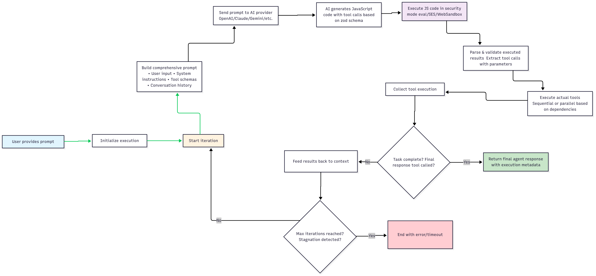

# AgentLoop

> **A TypeScript Framework for Building Tool-Using AI Agents**

AgentLoop is a TypeScript framework that enables developers to build AI agents capable of executing complex tool chains. With support for 10+ AI providers, JavaScript-based tool calling, and error handling, AgentLoop abstracts away the complexity of multi-step AI workflows while maintaining full type safety and extensibility.

**Note:** AgentLoop uses JavaScript-based tool calling instead of traditional function calling APIs. AI models generate JavaScript code that calls tools, providing more flexibility and control over execution flow.

[](https://www.typescriptlang.org/)
[](https://nodejs.org/)
[](LICENSE)
[](https://www.npmjs.com/package/agentloop)

## What's New in v2.0.0

- **Dynamic Re-Planning System**: Replaced static task lists with dynamic progress analysis for better task completion
- **Enhanced Security**: Completely removed eval execution mode - SES is now the only execution mode for maximum security
- **Intelligent Stagnation Prevention**: Advanced detection and recovery from repetitive actions
- **Linearized Data Structures**: Simplified and flattened data types for better performance and developer experience
- **XML References for Large Content**: Uses XML literal blocks to avoid string escaping issues when LLMs work with large content
- **Architecture Cleanup**: Removed outdated execution modes and streamlined the codebase

## 🚀 Key Features

### Multi-Provider AI Support
- **10+ AI Providers**: OpenAI, Google (Gemini), Anthropic (Claude), Mistral, Cohere, Groq, Fireworks, DeepSeek, Perplexity, Azure
- **Unified Interface**: Switch between providers without code changes
- **Provider-Specific Optimizations**: Automatic handling of rate limits, context windows, and capabilities

### Secure Code Execution
- **Maximum Security**: SES (Secure EcmaScript) is the only execution mode - no unsafe alternatives
- **Compartmentalized**: All AI-generated code runs in isolated SES compartments
- **Cross-Platform**: Works in Node.js and browsers with zero configuration
- **Zero Dependencies**: SES included out of the box, no additional installation needed

### Innovative Tool Calling
- **JavaScript-Based Tools**: AI writes JavaScript functions for tool execution
- **Type-Safe Validation**: Zod schemas ensure runtime type safety
- **XML Literal Blocks**: Reference large content without string escaping issues

```javascript
// Clean JavaScript without escaping:
writeFile("path", LiteralLoader.load("file_content_123"));
```

```xml
<literals>
  <literal id="file_content_123">
const data = "hello
world";
console.log(data);
  </literal>
</literals>
```

- **Additional Features**: Dependency management, parallel/sequential execution

### Error Handling & Monitoring
- **Stateless Architecture**: Horizontally scalable, no internal state storage
- **Error Handling**: Multiple error types with automatic retry logic
- **Dynamic Re-Planning**: AI analyzes progress and adapts strategy instead of following rigid task lists
- **Smart Stagnation Prevention**: Detects repetitive actions and guides AI toward task completion
- **Lifecycle Hooks**: Monitor and customize agent execution with progress updates

### Developer Experience
- **Full TypeScript Support**: Complete type safety from tools to responses
- **Extensible Architecture**: Custom providers, templates, and tool formats
- **Configurable**: Fine-tune behavior for different use cases
- **Error Recovery**: Built-in error handling and retry mechanisms

## Installation

```bash
npm install agentloop
```

**That's it!** SES (Secure EcmaScript) is included out of the box for secure JavaScript execution.

## Quick Start

### Basic Agent Setup

```typescript
import { AgentLoop, FormatMode } from 'agentloop';
import { DefaultAIProvider } from 'agentloop/providers';

class MyAgent extends AgentLoop {
  protected systemPrompt = "You are a helpful assistant with file management capabilities.";
  
  constructor() {
    super(new DefaultAIProvider({
      service: 'openai',
      apiKey: process.env.OPENAI_API_KEY,
      model: 'gpt-4'
    }), {
      formatMode: FormatMode.LITERAL_JS,
      maxIterations: 10
    });
    
    this.setupTools();
  }
  
  private setupTools() {
    // Define your tools with Zod validation
    this.defineTool(z => ({
      name: 'read_file',
      description: 'Read contents of a file',
      argsSchema: z.object({
        filepath: z.string().describe('Path to the file')
      }),
      handler: async ({ args }) => {
        const content = await fs.readFile(args.filepath, 'utf8');
        return { content, success: true };
      }
    }));
  }
}
```

### Running the Agent

```typescript
const agent = new MyAgent();

// Manage conversation history as array
const conversationHistory: Array<{role: 'user' | 'agent', message: string}> = [];

// Push user message first
conversationHistory.push({ role: 'user', message: "Read the package.json file and tell me about the project" });

const result = await agent.run({
  userPrompt: "Read the package.json file and tell me about the project",
  ...(conversationHistory.length > 1 && {
    context: {
      "Old Conversation History": conversationHistory
        .slice(0, -1) // Exclude current user message
        .map(entry => `${entry.role}: ${entry.message}`)
        .join('\n')
    }
  })
});

// Push agent response after receiving it
if (result.agentResponse) {
  conversationHistory.push({
    role: 'agent',
    message: String((result.agentResponse.args as Record<string, unknown>)?.value) || ""
  });
}

console.log(result.agentResponse?.args);
```

## 📖 API Reference

### `run(input: AgentRunInput): Promise<AgentRunOutput>`

The main method to execute the agent. This is a stateless operation that processes a single turn of conversation.

#### Parameters (`AgentRunInput`)

| Property | Type | Required | Description |
|----------|------|----------|-------------|
| `userPrompt` | `string` | ✅ | The user's message or instruction to the agent |
| `context` | `Record<string, unknown>` | ❌ | Context data including conversation history (pass history as `context["Conversation History"]`) |
| `completionOptions` | `Record<string, unknown>` | ❌ | Optional AI provider completion options (temperature, max_tokens, etc.) |

#### Return Value (`AgentRunOutput`)

| Property | Type | Description |
|----------|------|-------------|
| `interactionHistory` | `Interaction[]` | Complete interaction history including the new turn. **Persist this for the next run** |
| `agentResponse` | `AgentResponse?` | The agent's final response (only present if agent called the `final_tool`) |

#### Interaction Types

An `Interaction` can be one of:
- **`UserPrompt`** - User's input message with `message` field
- **`ToolCallReport`** - Results from tool execution(s) with linearized `ToolCall[]` 
- **`AgentResponse`** - Agent's final response with `args` field containing the response data

#### Data Structure - Linearized & Simplified

AgentLoop uses a **linearized data structure** for better type safety and easier access:

```typescript
// ✅ NEW: Direct field access
interface ToolCall {
  taskId: string;
  type: "tool_call";
  timestamp: string;
  toolName: string;    // Direct access (was: result.context.toolName)
  success: boolean;    // Direct access (was: result.context.success)  
  error?: string;      // Direct access (was: result.context.error)
  args: unknown;       // All tool data (was: result.context.*)
}

interface UserPrompt {
  taskId: string;
  type: "user_prompt";
  timestamp: string;
  message: string;     // Direct access (was: prompt.context)
}

interface AgentResponse {
  taskId: string;
  type: "assistant";
  timestamp: string;
  args: unknown;       // Response data (was: response.context)
  error?: string;
  tokenUsage?: TokenUsage;
}
```

**Benefits**: No more nested `.context` properties - everything is top-level and type-safe.

#### Example Usage

```typescript
// Manage conversation history as array
const conversationHistory: Array<{role: 'user' | 'agent', message: string}> = [];

// Push user message first
conversationHistory.push({ role: 'user', message: "Read the file config.json" });

const result1 = await agent.run({
  userPrompt: "Read the file config.json",
  ...(conversationHistory.length > 1 && {
    context: {
      "Conversation History": conversationHistory
        .slice(0, -1) // Exclude current user message
        .map(entry => `${entry.role}: ${entry.message}`)
        .join('\n')
    }
  })
});

// Push agent response after receiving it
if (result1.agentResponse) {
  conversationHistory.push({
    role: 'agent',
    message: String((result1.agentResponse.args as Record<string, unknown>)?.value) || ""
  });
}

// Continue conversation
// Push user message first
conversationHistory.push({ role: 'user', message: "Now analyze the configuration" });

const result2 = await agent.run({
  userPrompt: "Now analyze the configuration",
  ...(conversationHistory.length > 1 && {
    context: {
      "Conversation History": conversationHistory
        .slice(0, -1) // Exclude current user message
        .map(entry => `${entry.role}: ${entry.message}`)
        .join('\n'),
      "priority": "high"
    }
  }),
  completionOptions: { temperature: 0.3 }
});

// Push agent response after receiving it
if (result2.agentResponse) {
  conversationHistory.push({
    role: 'agent',
    message: String((result2.agentResponse.args as Record<string, unknown>)?.value) || ""
  });
}

// Final response from agent (if any)
if (result2.agentResponse) {
  console.log("Agent says:", result2.agentResponse.args);
}
```

#### Stateless Design & Conversation Management

AgentLoop is **completely stateless** - it doesn't store any conversation history internally. The new context-based approach gives you complete control over conversation history:

**Key Changes in v2.0.0:**
- ✅ **No more `prevInteractionHistory`**: Replaced with flexible context-based approach
- ✅ **Full Control**: You decide how to format and structure conversation history
- ✅ **Custom Formats**: Support any history format that works for your use case
- ✅ **Scalable**: Easy to persist to databases, session storage, or distributed systems

**How it Works:**
1. **Pass conversation history in `context["Conversation History"]`** as a formatted string
2. **Build and maintain the history string** between turns using your preferred format
3. **Handle conversation state** in your application with full control over structure

**Example of Different History Formats:**

```typescript
// Array format (recommended)
const conversationHistory: Array<{role: 'user' | 'agent', message: string}> = [
  { role: 'user', message: 'Hello' },
  { role: 'agent', message: 'Hi there!' },
  { role: 'user', message: "What's 2+2?" },
  { role: 'agent', message: 'The answer is 4' }
];

// Alternative: Simple string format
let historyString = "User: Hello\nAgent: Hi there!\nUser: What's 2+2?\nAgent: The answer is 4\n";

// Alternative: Custom structured format
let structuredHistory = `
=== Conversation Context ===
Previous Questions: 2
Last Topic: Mathematics
User Preferences: Detailed explanations

=== History ===
[Turn 1] User: Hello
[Turn 1] Agent: Hi there!
[Turn 2] User: What's 2+2?
[Turn 2] Agent: The answer is 4
`;

// Use the array format with conditional context
// Push user message first
conversationHistory.push({ role: 'user', message: "Continue our conversation" });

const result = await agent.run({
  userPrompt: "Continue our conversation",
  ...(conversationHistory.length > 1 && {
    context: {
      "Conversation History": conversationHistory
        .slice(0, -1) // Exclude current user message
        .map(entry => `${entry.role}: ${entry.message}`)
        .join('\n'),
      "User Preferences": "concise",
      "Session ID": "abc-123"
    }
  })
});

// Push agent response after receiving it
if (result.agentResponse) {
  conversationHistory.push({
    role: 'agent',
    message: String((result.agentResponse.args as Record<string, unknown>)?.value) || ""
  });
}
```

This design makes AgentLoop incredibly flexible and easy to integrate with any storage or state management system.

### JavaScript Execution Security

AgentLoop uses **SES (Secure EcmaScript)** as the only execution mode for maximum security:

```typescript
const agent = new MyAgent(provider); // SES is always used - no configuration needed
```

#### SES (Secure EcmaScript) - Only Mode
- **🔒 Maximum Security**: All code runs in isolated compartments
- **🛡️ Memory Safe**: No access to global objects or sensitive APIs
- **📦 Zero Configuration**: SES included out of the box
- **🌐 Cross-Platform**: Works identically in Node.js and browsers
- **🚫 No Unsafe Alternatives**: Eliminates any possibility of insecure execution

**Why SES-Only?**
- **Security First**: No compromise on security - every execution is safe
- **Predictable**: Consistent security model across all environments
- **Zero-Risk**: Eliminates entire class of security vulnerabilities
- **Production Ready**: Battle-tested secure execution without complexity

## 🛠️ Core Concepts

### Dynamic Re-Planning System

AgentLoop uses an advanced dynamic re-planning system that eliminates infinite loops and improves task completion:

#### How It Works
```typescript
// The AI uses self-reasoning to track progress and plan actions
{
  goal: "List files in the directory",
  goal_status: "pending",  // or "success"/"failed"
  pending_action: "Executing list_files tool to get directory contents",
  progress_summary: "1. Received user request to list directory files"
}
```

#### Key Benefits
- **No More Static Task Lists**: AI dynamically analyzes what's been accomplished
- **Intelligent Decision Making**: AI decides next actions based on current progress
- **Automatic Task Completion**: AI recognizes when enough data is gathered
- **Stagnation Prevention**: Detects and prevents repetitive actions

#### Progress Tracking
The system displays progress in a structured format:
```
# CURRENT TASK PROGRESS

## EXECUTION HISTORY  
### Turn 1: Listing files in current directory
  - Tool `list_files` -> SUCCESS
    Output: {"files": ["package.json", "src/", "README.md"]}

## PROGRESS SUMMARY
1. Listed directory contents and found 3 items including package.json and src folder
Currently executing list_files tool to get directory contents (success)

## NEXT TASK
Analyze the progress above and determine the best action to achieve the user's goal.
```

### Tools with Dependencies
```typescript
this.defineTool(z => ({
  name: 'analyze_code',
  description: 'Analyze code quality',
  dependencies: ['read_file'],  // Depends on read_file tool
  argsSchema: z.object({
    filepath: z.string()
  }),
  handler: async ({ args, dependencies }) => {
    const fileContent = dependencies.read_file.result.content;
    // Analyze the content...
  }
}));
```

### JavaScript Tool Calling Format
AI writes JavaScript functions for structured tool execution:

```javascript
import { LiteralLoader, toolCalls } from './utils';
import { toolSchemas } from './toolSchemas';

function callTools() {
  toolCalls.push(
    toolSchemas.read_file.parse({
      filepath: "package.json"
    })
  );
  
  toolCalls.push(
    toolSchemas.final_tool.parse({
      value: LiteralLoader("analysis-result")
    })
  );
  
  return toolCalls;
}
```

### Lifecycle Hooks
```typescript
const agent = new MyAgent({
  hooks: {
    onToolCallStart: async (call) => {
      console.log(`Executing: ${call.toolName}`);
    },
    onProgressUpdate: async (progressSummary, pendingAction, goal, iteration) => {
      console.log(`Turn ${iteration}: ${goal}`);
      console.log(`Progress: ${progressSummary}`);
      console.log(`Current: ${pendingAction}`);
    },
    onStagnationDetected: async (repeatedAction, iteration) => {
      console.log(`Stagnation detected at turn ${iteration}: ${repeatedAction}`);
    },
    onError: async (error) => {
      logger.error('Agent error:', error);
    }
  }
});
```

## 🏗️ Architecture

### Process Flow



The diagram above illustrates AgentLoop's iterative execution process: receiving user input, building prompts with context and tool schemas, generating and executing JavaScript code through AI providers, validating and executing tools, and feeding results back into the loop until task completion.

### Key Components

- **AgentLoop**: Main execution engine with stateless design
- **AIProvider**: Abstraction layer for multiple AI services  
- **FormatHandler**: Manages tool calling formats and execution
- **PromptManager**: Handles prompt templates and context
- **ToolSystem**: Type-safe tool definition and execution
- **ErrorHandler**: Error management and recovery

## 📋 Examples

### File Management Agent
```typescript
import { AgentLoop } from 'agentloop';
import { DefaultAIProvider } from 'agentloop/providers';
import { z } from 'zod';
import * as fs from 'fs/promises';
import * as path from 'path';

class FileManagerAgent extends AgentLoop {
  protected systemPrompt = "You are a helpful file management assistant. Help users read, write, and organize files safely.";

  constructor(private basePath: string = process.cwd()) {
    super(new DefaultAIProvider({
      service: 'openai',
      apiKey: process.env.OPENAI_API_KEY!,
      model: 'gpt-4'
    }));

    this.setupTools();
  }

  private setupTools() {
    this.defineTool(z => ({
      name: 'read_file',
      description: 'Read the contents of a file',
      argsSchema: z.object({
        filepath: z.string().describe('Path to the file to read')
      }),
      handler: async ({ args }) => {
        try {
          const fullPath = path.resolve(this.basePath, args.filepath);
          const content = await fs.readFile(fullPath, 'utf8');
          const stats = await fs.stat(fullPath);
          return { 
            content, 
            filepath: args.filepath,
            size: stats.size,
            success: true 
          };
        } catch (error) {
          return { 
            error: error.message, 
            success: false 
          };
        }
      }
    }));

    this.defineTool(z => ({
      name: 'write_file',
      description: 'Write content to a file',
      argsSchema: z.object({
        filepath: z.string().describe('Path to the file to write'),
        content: z.string().describe('Content to write to the file')
      }),
      handler: async ({ args }) => {
        try {
          const fullPath = path.resolve(this.basePath, args.filepath);
          await fs.mkdir(path.dirname(fullPath), { recursive: true });
          await fs.writeFile(fullPath, args.content);
          
          return { 
            filepath: args.filepath,
            bytesWritten: Buffer.byteLength(args.content, 'utf8'),
            success: true 
          };
        } catch (error) {
          return { 
            error: error.message, 
            success: false 
          };
        }
      }
    }));

    this.defineTool(z => ({
      name: 'list_directory',
      description: 'List files and directories in a path',
      argsSchema: z.object({
        dirpath: z.string().optional().describe('Directory path (default: current directory)')
      }),
      handler: async ({ args }) => {
        try {
          const fullPath = path.resolve(this.basePath, args.dirpath || '.');
          const entries = await fs.readdir(fullPath, { withFileTypes: true });
          
          const items = entries.map(entry => ({
            name: entry.name,
            type: entry.isDirectory() ? 'directory' : 'file'
          }));

          return { 
            path: args.dirpath || '.',
            items,
            count: items.length,
            success: true 
          };
        } catch (error) {
          return { 
            error: error.message, 
            success: false 
          };
        }
      }
    }));

    this.defineTool(z => ({
      name: 'final_response',
      description: 'Provide the final response to the user',
      argsSchema: z.object({
        message: z.string().describe('Final message to the user')
      }),
      handler: async ({ args }) => ({ message: args.message, final: true })
    }));
  }
}

// Usage
const agent = new FileManagerAgent('/project/path');
const result = await agent.run({
  userPrompt: "List all files in the src directory, read package.json, and create a project-info.md file with a summary of the project structure and dependencies",
  context: {
    "Conversation History": ""
  }
});
```

### Development Scripts
```bash
# Build and run examples
npm run build:examples
node dist/console.js

# Run code editor demo
npm run demo:codeeditor

# Development with watch mode
npm run dev:watch
```

## ⚙️ Configuration

### Agent Options
```typescript
interface AgentLoopOptions {
  maxIterations?: number;                    // Max reasoning iterations (default: 100)
  parallelExecution?: boolean;              // Run tools in parallel (default: true)
  toolTimeoutMs?: number;                   // Tool execution timeout (default: 30s)
  // JavaScript execution is always secure with SES - no configuration needed
  stagnationTerminationThreshold?: number;  // Prevent infinite loops (default: 3)
  maxInteractionHistoryCharsLimit?: number; // Memory management (default: 100k)
  sleepBetweenIterationsMs?: number;        // Rate limiting (default: 2s)
  hooks?: AgentLifecycleHooks;              // Event handlers including progress updates
}

interface AgentLifecycleHooks {
  onIterationStart?: (iteration: number) => Promise<void>;
  onToolCallStart?: (call: PendingToolCall) => Promise<void>;
  onToolCallEnd?: (result: ToolCall) => Promise<void>;
  onProgressUpdate?: (progressSummary: string | null, pendingAction: string | null, goal: string | null, iteration: number) => Promise<void>;
  onStagnationDetected?: (repeatedAction: string, iteration: number) => Promise<void>;
  onAgentFinalResponse?: (result: AgentResponse) => Promise<void>;
  onError?: (error: AgentError) => Promise<void>;
}
```

### AI Provider Configuration
```typescript
// OpenAI
new DefaultAIProvider({
  service: 'openai',
  apiKey: process.env.OPENAI_API_KEY,
  model: 'gpt-4o',
  temperature: 0.1
})

// Google Gemini
new DefaultAIProvider({
  service: 'google', 
  apiKey: process.env.GEMINI_API_KEY,
  model: 'gemini-2.0-flash'
})

// Anthropic Claude
new DefaultAIProvider({
  service: 'anthropic',
  apiKey: process.env.ANTHROPIC_API_KEY,
  model: 'claude-3-5-sonnet-20241022'
})
```

## Security

AgentLoop uses **SES (Secure EcmaScript)** as the only execution mode for maximum security:

- **Compartmentalized Execution**: All AI-generated code runs in isolated SES compartments
- **Zero Configuration**: SES is included and enabled by default
- **Cross-Platform**: Works identically in Node.js and browsers
- **No Unsafe Alternatives**: Removed eval and other insecure execution modes

```typescript
// Security is automatic - no configuration needed
const agent = new MyAgent(aiProvider, {
  maxIterations: 10,
  parallelExecution: true
  // SES security is always enabled
});
```

## 🔧 Additional Features

### Custom AI Providers
```typescript
class CustomProvider implements AIProvider {
  async completion(prompt: string): Promise<AICompletionResponse> {
    // Implement your custom AI integration
  }
}
```

### Custom Tool Formats
```typescript
class CustomFormatHandler implements FormatHandler {
  async parseResponse(response: string, tools: Tool[]): Promise<PendingToolCall[]> {
    // Parse custom tool calling format
  }
}
```

### Custom Prompt Templates
```typescript
class CustomTemplate implements BasePromptTemplate {
  buildPrompt(params: BuildPromptParams): string {
    // Build custom prompt structure
  }
}
```

## 📊 Error Handling

AgentLoop provides error handling with automatic recovery:

```typescript
enum AgentErrorType {
  TOOL_NOT_FOUND = 'tool_not_found',
  INVALID_RESPONSE = 'invalid_response', 
  TOOL_EXECUTION_ERROR = 'tool_execution_error',
  STAGNATION_ERROR = 'stagnation_error',
  // ... 15 more error types
}
```

### Retry Configuration
```typescript
{
  toolExecutionRetryAttempts: 5,    // Retry tool failures
  connectionRetryAttempts: 3,       // Retry AI provider failures
  retryDelay: 1000,                 // Delay between retries
  failureHandlingMode: 'fail_fast'  // How to handle failures
}
```

## 🧪 Testing

```bash
# Run all tests
npm test

# Run specific test suites
npm run test:unit
npm run test:integration  
npm run test:gemini

# Test coverage
npm run test:coverage
```

## 📚 Documentation

- [API Reference](./docs/api-reference.md) - Complete API documentation
- [Tool Development Guide](./docs/tool-development.md) - Creating custom tools
- [Provider Integration](./docs/provider-integration.md) - Adding AI providers
- [Examples Guide](./docs/examples.md) - Detailed example walkthroughs
- [Deployment Guide](./docs/deployment.md) - Production deployment patterns

## 🤝 Contributing

We welcome contributions! Please see our [Contributing Guide](CONTRIBUTING.md) for details.

1. Fork the repository
2. Create your feature branch: `git checkout -b feature/amazing-feature`
3. Commit your changes: `git commit -m 'Add amazing feature'`
4. Push to the branch: `git push origin feature/amazing-feature`
5. Open a Pull Request

## 📄 License

This project is licensed under the ISC License - see the [LICENSE](LICENSE) file for details.

## 🙏 Acknowledgments

- Built with [AI-SDK](https://github.com/vercel/ai) for unified AI provider access
- Powered by [Zod](https://github.com/colinhacks/zod) for runtime type safety
- Secure execution via [SES](https://github.com/endojs/endo) (Secure ECMAScript)
- Inspired by the agent frameworks community

---

**AgentLoop** - Build AI Agents That Get Things Done
